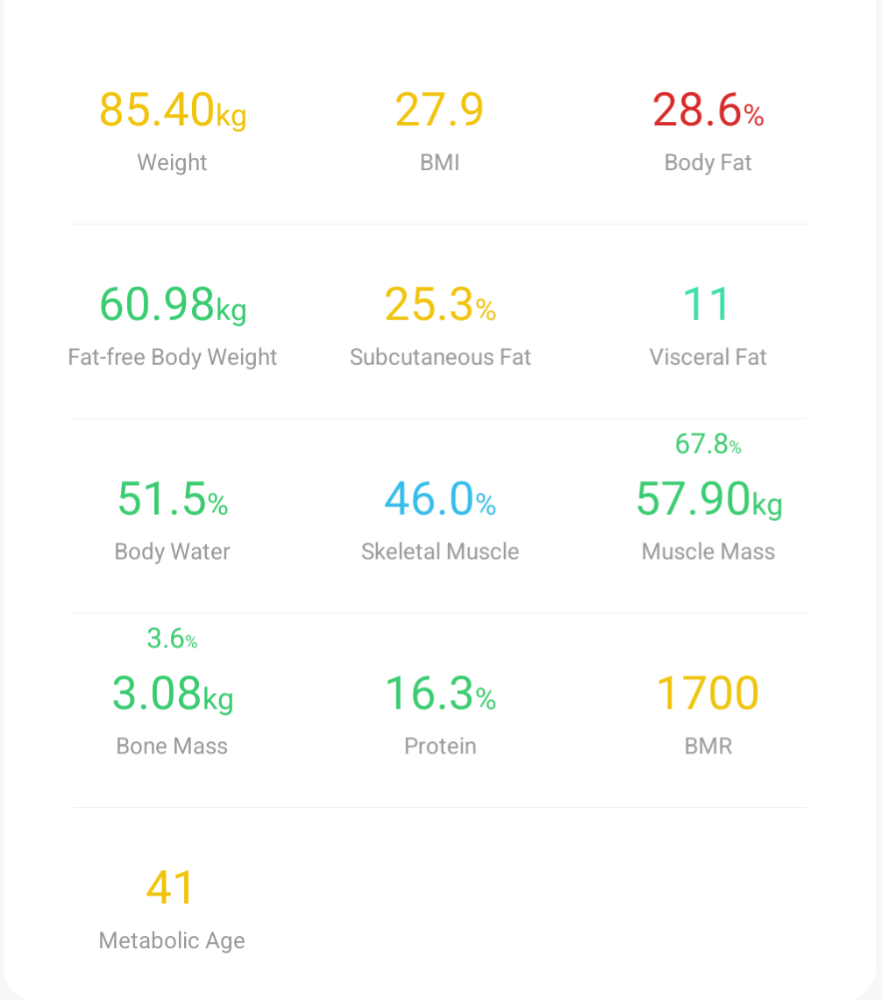
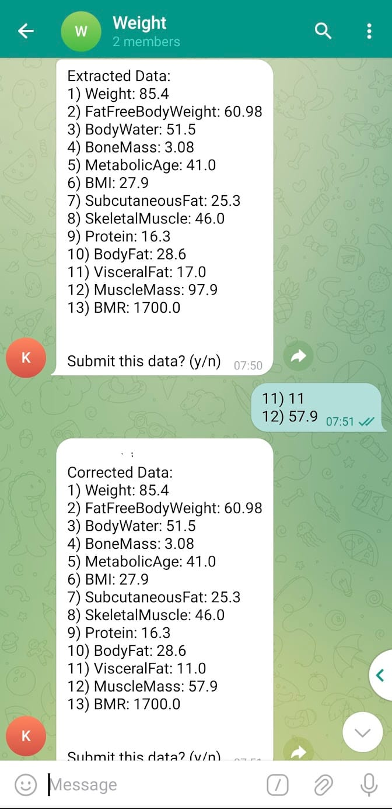

# Renpho-data-extractor

## Name
Renpho scale weight/health data extractor

## Description
I've talked about making the application in my blog post [here](https://medium.com/@dpgregson/taking-back-my-own-data-e195a8d5726b)

This app was created as a means of allowing me to take a cropped picture of the data section of a renpho health screen and submit it to a telegram bot and have it eventually wind up in InfluxDB/Grafana. It also allows the user to make some simple corrections by entering some additional data if needed into the chat window and utilising y/n to confirm whether they wish to submit their data. 

Example:

Here is the Renpho health screen cropped:
 

Here is what happens when you submit that image to the bot:
 

The project was a learning exercise to better familiarise myself with some python code whilst simultaneously creating something useful for myself.
Please excuse my messy and inexperienced python code 

## Usage

### Prerequisites
This project assumes that you are familiar with and have already created a telegram bot through the [BotFather](https://core.telegram.org/bots/tutorial) as well as having your own influxDB and/or Grafana instance set up

### Running the code
If you wish to run this code for yourself you can run the associated Dockerfile. You'll need to set the following environment variables on that container:
- BOT_TOKEN
- TARGET_CHAT_ID
- INFLUX_BUCKET
- INFLUX_TOKEN
- INFLUX_ORG
- INFLUX_PORT
- INFLUX_IP

You'll notice that there's a fair few Influx DB values to be set. That's because this was designed to send data to InfluxDB to then be used within Grafana.
Once running it should poll the linked telegram bot for updates.

## Roadmap
Items TODO include:
- Learn about (and then add) python tests
- Abstract notification channels away from Telegram specifically and make them pluggable
- Abstract data storage away from being specifically tied to InfluxDB
- Clean up class responsibilities
- Make the udpate timeout configurable
- Make the extraction of text data to object more configurable/allow text extraction to work with different platforms
- Allow data corrections to train the pytesseract model that the container is running
